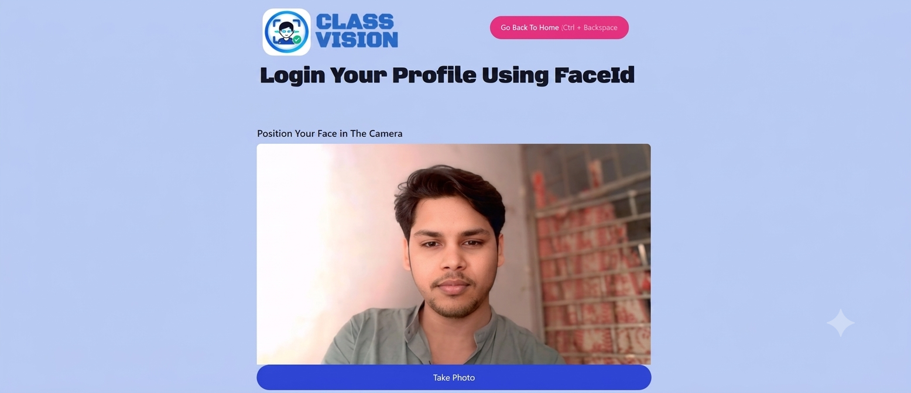
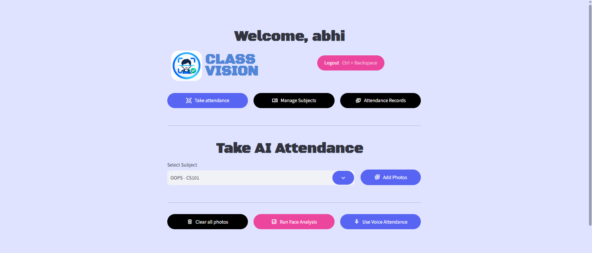
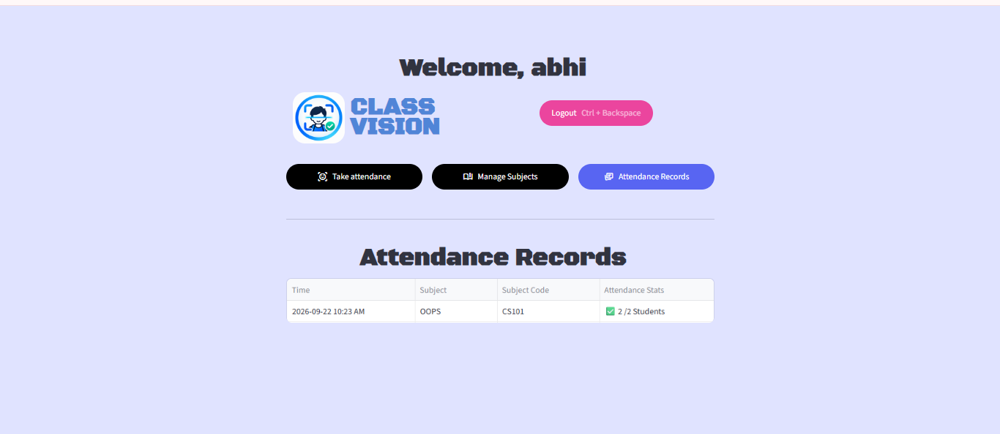
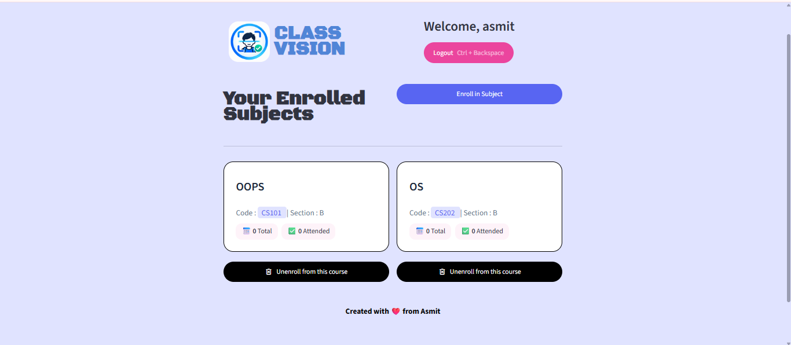
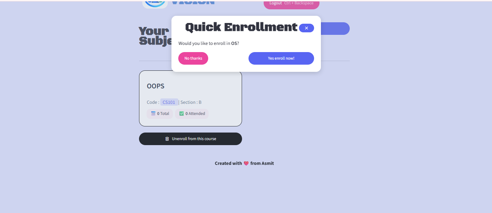
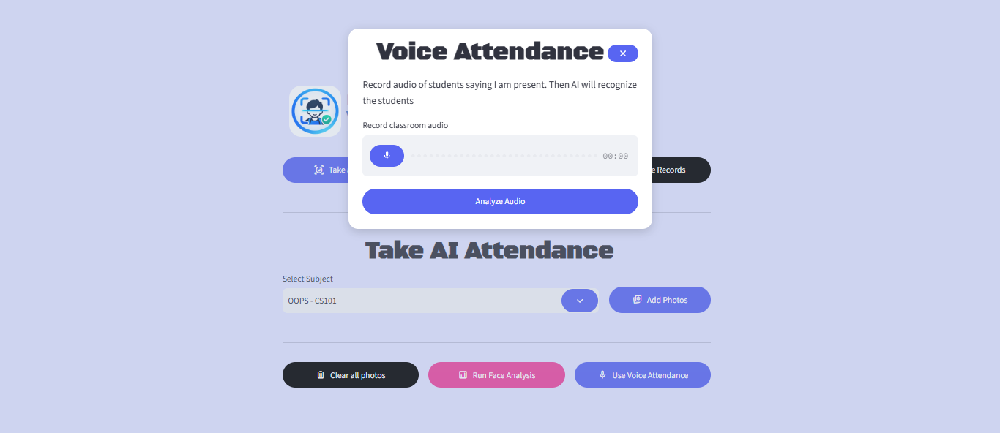

# ClassVision - AI That Recognize Your Class

ClassVision is an AI-powered smart attendance management system designed to make classroom attendance faster, easier, and more reliable.

Instead of relying on traditional roll calls or manual attendance sheets, ClassVision uses Face and voice Recognition technology to identify students and automate the attendance process.

The platform provides separate interfaces for Teachers and Students. Teachers can create and manage subjects, enroll students using unique join codes and QR codes, capture classroom images for attendance, and monitor attendance records. Students can securely access the system using facial recognition, join subjects, and view their attendance history.

ClassVision combines Artificial Intelligence, Computer Vision, and modern web technologies to create a practical solution for smarter classroom management.

 ## Key Highlights
 🤖 AI-Powered Face Recognition – Automatically identify students using facial features.
 📸 Smart Attendance – Mark attendance from classroom images instead of manual roll calls. 
 👨‍🏫 Teacher Dashboard – Create subjects, manage classes, and track attendance. 
 👨‍🎓 Student Dashboard – Join classes and monitor attendance records.
 🔗 Join Codes – Students can quickly enroll in subjects using unique class codes. 
 📱 QR Code Enrollment – Teachers can share QR codes for faster class enrollment.
 📊 Attendance Tracking – Maintain organized attendance records for students and subjects. 
 ☁️ Cloud Database – Uses Supabase for storing users, subjects, enrollments, and attendance data. 

 ## Project Screenshots

    

 
    

      

 
    

 
    

 

 
    

## Tech Stack & Technologies Used

ClassVision combines Artificial Intelligence, Computer Vision, Voice Processing, Cloud Database, and Web Technologies to build a complete smart attendance management system.

### 🎨 Streamlit

Streamlit is used to build the interactive web interface of ClassVision.

#### Key Features Used:

Interactive Teacher and Student dashboards
Forms for login, registration, and subject creation
Image uploading and classroom attendance capture
Attendance tables and records visualization
Session-based navigation and authentication flow
Fast deployment of the AI-powered web application

### ☁️ Supabase
Supabase is used as the cloud backend and database platform for storing and managing application data.

#### Key Features Used:

User data storage
Teacher and student records
Subject and classroom management
Student enrollment records
Attendance data storage
Join code management
Cloud-based database access
Secure data retrieval and updates
### 🧠 dlib

dlib is used for computer vision and facial feature processing.

#### Key Features Used:

Face detection
Facial landmark detection
Face feature extraction
Generation of facial embeddings
Support for accurate face comparison and recognition

dlib provides the underlying face-processing capabilities used by the facial recognition system.

### 🤖 Face Recognition

Face Recognition technology is the core AI component responsible for identifying students through their facial features.

#### Key Features Used:

Student face detection
Face encoding generation
Comparison of facial embeddings
Student identity matching
Recognition of multiple students from classroom images
Automated attendance marking
Reduction of manual attendance effort

The system compares detected student faces with stored facial encodings to identify students and mark their attendance.

### 🎙️ Librosa

Librosa is used for audio processing and feature extraction.

#### Key Features Used:

Audio file processing
Voice signal analysis
Audio normalization
Feature extraction from speech recordings
Preprocessing voice samples before speaker verification

Librosa helps prepare and analyze voice recordings used by the voice authentication system.

### 🗣️ Resemblyzer

Resemblyzer is used for AI-based speaker recognition and voice verification.

#### Key Features Used:

Voice embedding generation
Speaker identity representation
Voice similarity comparison
Student voice verification
Additional biometric authentication support

Resemblyzer converts a person's voice into numerical embeddings that can be compared with previously stored voice samples.

### 🌐 Flask

Flask is used to create lightweight backend services and APIs for AI-related operations.

#### Key Features Used:

REST API development
Communication between application components
AI model integration
Handling prediction and recognition requests
Sending JSON responses
Connecting frontend applications with backend AI services

Flask helps separate AI processing logic from the user interface and makes the system easier to scale and integrate.

## 🔄 Technology Flow
Streamlit provides the user interface for Teachers and Students.
Supabase stores users, subjects, enrollment data, and attendance records.
dlib and Face Recognition process facial images and generate face embeddings.
Classroom images are analyzed to automatically recognize students and mark attendance.
Librosa processes and prepares voice recordings.
Resemblyzer generates voice embeddings and performs speaker verification.
Flask provides backend API services for AI and recognition-related operations.
All components work together to create a secure and intelligent attendance management system.

## 🎯 Project Goal

The goal of ClassVision is to reduce the time teachers spend taking attendance while providing a simple, scalable, and AI-driven attendance management system for educational institutions.

### License
Copyright © 2026 Asmit. All Rights Reserved.

This project is publicly available for viewing and portfolio evaluation only. Copying, modifying, redistributing, publishing, or using this project's source code without prior permission is prohibited.

See the LICENSE file for details.
